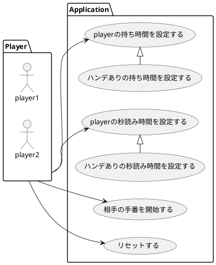

<!---
ユースケース図を描く
--->
# アプリケーション”ChessClock”のユースケース図
|システムID|システム名称|
|:--|:--|
|VB-pra01|ChessClock|

## ユースケース図

```plantuml
@startuml
left to right direction

package Player {
 actor player1 as p1
 actor player2 as p2
}
package Application {
  usecase "playerの持ち時間を設定する" as UC1
  usecase "playerの秒読み時間を設定する" as UC2

  usecase "ハンデありの持ち時間を設定する" as UC1_1
  usecase "ハンデありの秒読み時間を設定する" as UC2_1

  usecase "相手の手番を開始する" as UC3
  usecase "リセットする" as UC4
  
}

Player --> UC1
Player --> UC2
Player --> UC3
Player --> UC4

UC1_1 -|> UC1
UC2_1 -|> UC2

@enduml
```

