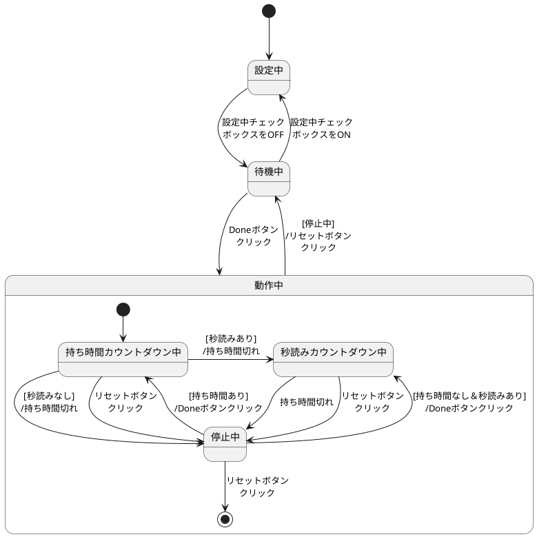

<!---
状態遷移図と状態遷移表を描く
--->
# 状態遷移分析
| システムID | システム名称 |
| ------ | ------ |
|VB-pra01|ChessClock|

## 状態遷移図

## 状態遷移表
| 状態\イベント         | 設定中 | 待機中 | 持ち時間カウントダウン中 | 秒読みカウントダウン中 | 停止中 |
| -------------------- | ----- | ----- | ---------------------- | -------------------- | ----- |
| 設定中checkboxを変更  | 待機中 | 設定中 | -                      | -                   | -     |
| Doneボタンクリック    | -      | 動作中 | -                     | -                    | [持ち時間あり]/持ち時間カウントダウン中[持ち時間なし＆秒読みあり]/秒読みカウントダウン中 |
| リセットボタンクリック | -     | -      | 停止中                 | 停止中               | 待機中 |
| 持ち時間切れ          | -   | -   | [秒読みあり]/秒読みカウントダウン中| 停止中          | -      |
