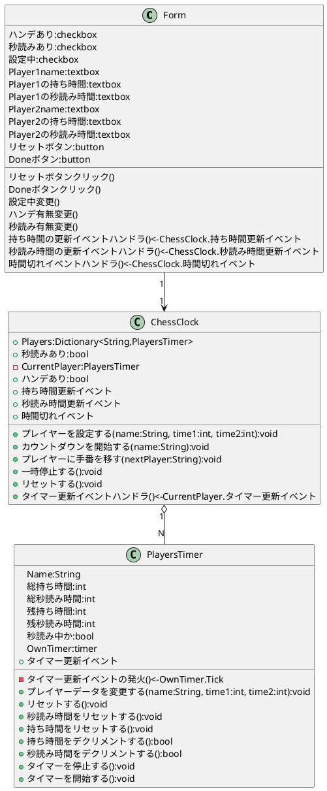

<!---
システムのクラス図を描く
--->
# アプリケーション”ChessClock”のクラス図
| システムID | システム名称 |
| ------ | ------ |
|VB-pra01|ChessClock|

## クラス図

```plantuml
@startuml
skinparam groupInheritance 3

class Form{
  ハンデあり:checkbox
  秒読みあり:checkbox
  設定中:checkbox
  Player1name:textbox
  Player1の持ち時間:textbox
  Player1の秒読み時間:textbox
  Player2name:textbox
  Player2の持ち時間:textbox
  Player2の秒読み時間:textbox
  リセットボタン:button
  Doneボタン:button
  リセットボタンクリック()
  Doneボタンクリック()
  設定中変更()
  ハンデ有無変更()
  秒読み有無変更()
  持ち時間の更新イベントハンドラ()<-ChessClock.持ち時間更新イベント
  秒読み時間の更新イベントハンドラ()<-ChessClock.秒読み時間更新イベント
  時間切れイベントハンドラ()<-ChessClock.時間切れイベント
}

class ChessClock{
  +Players:Dictionary<String,PlayersTimer>
  +秒読みあり:bool
  -CurrentPlayer:PlayersTimer
  +ハンデあり:bool
  +持ち時間更新イベント
  +秒読み時間更新イベント
  +時間切れイベント
  
  +プレイヤーを設定する(name:String, time1:int, time2:int):void
  +カウントダウンを開始する(name:String):void
  +プレイヤーに手番を移す(nextPlayer:String):void
  +一時停止する():void
  +リセットする():void
  +タイマー更新イベントハンドラ()<-CurrentPlayer.タイマー更新イベント
}

class PlayersTimer{
  Name:String
  総持ち時間:int
  総秒読み時間:int
  残持ち時間:int
  残秒読み時間:int
  秒読み中か:bool
  OwnTimer:timer
  +タイマー更新イベント

  -タイマー更新イベントの発火()<-OwnTimer.Tick
  +プレイヤーデータを変更する(name:String, time1:int, time2:int):void
  +リセットする():void
  +秒読み時間をリセットする():void
  +持ち時間をリセットする():void
  +持ち時間をデクリメントする():bool
  +秒読み時間をデクリメントする():bool
  +タイマーを停止する():void
  +タイマーを開始する():void
}

Form "1" --> "1" ChessClock
ChessClock "1" o-- "N" PlayersTimer
@enduml
```